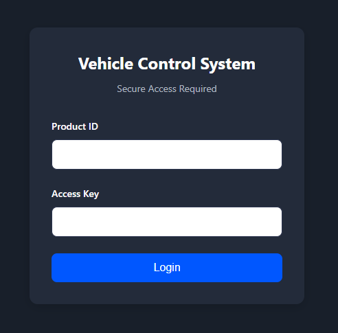
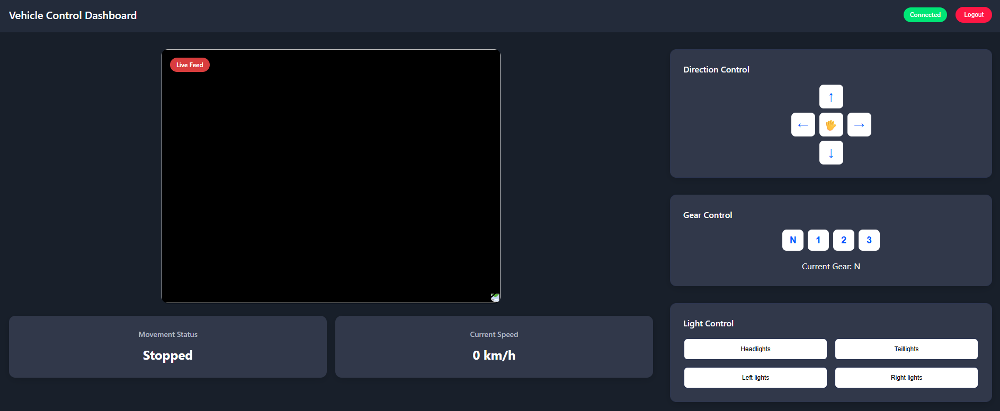
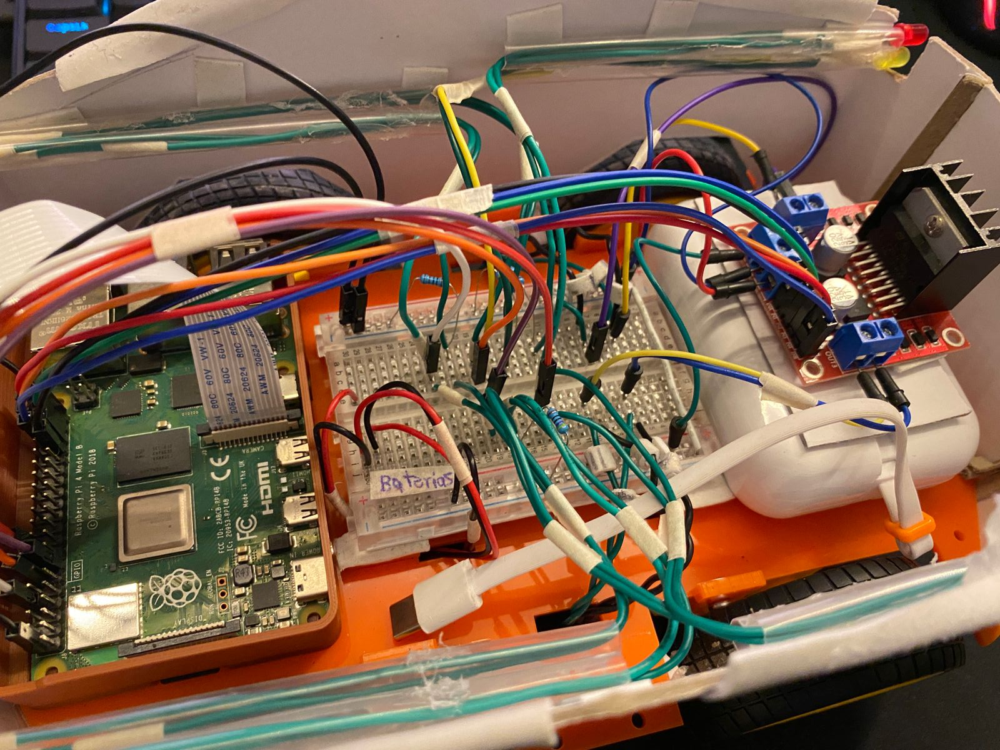
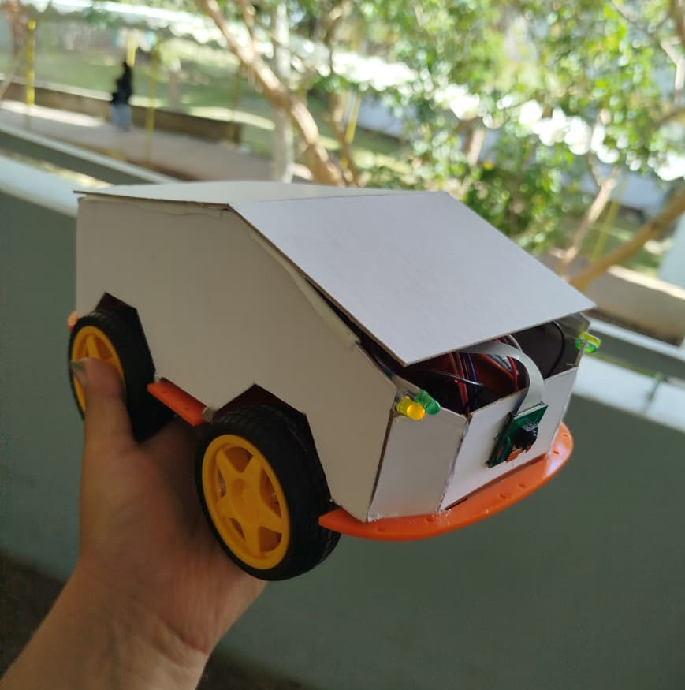
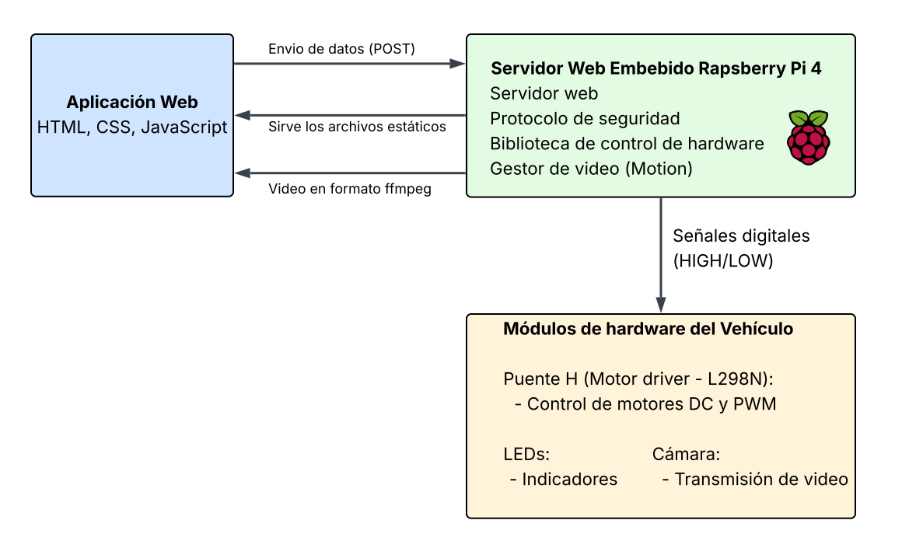

# Proyecto 1: Auto Control Remoto Yocto

Este proyecto implementa un sistema embebido en Raspberry Pi 4 con Linux mínimo generado mediante Yocto. Permite controlar un vehículo remoto a través de una aplicación web conectada a un servidor embebido, ofreciendo movimiento en cuatro direcciones, tres velocidades, control de luces (automáticas y manuales) y transmisión de video en tiempo real. Incluye una librería propia para el control e implementa el desarrollo cruzado.

## Control remoto de vehículo

El sistema está diseñado para el control remoto de un vehículo autónomo mediante un servidor web, utilizando una imagen de Linux en Raspberry Pi 4 creada con Yocto Project.

### Características principales
- **Control de movimiento**: Adelante, atrás, izquierda y derecha.
- **Velocidades**: Control de velocidad mediante PWM.
- **Luces indicadoras**: LEDs delanteros, traseros y direccionales (control automático y manual).
- **Transmisión de video en tiempo real** desde cámara conectada al sistema embebido.
- **Biblioteca propia** para control de GPIO, motores, LEDs y cámara.
- **Servidor web** accesible vía WiFi.
- **Desarrollo cruzado**: compilación en host, ejecución en target.

### Tecnologías y herramientas de desarrollo
- **Yocto Project** – para la construcción de imagen mínima de Linux.
- **CMake** – para el sistema de construcción de software (desarrollo cruzado).
- **C** – para la librería de control de hardware y servidor web embebido.
- **HTML/CSS/JavaScript** - para el diseño y funcionamiento de la aplicación web. 
- **GitHub** – para el control de versiones y gestión del repositorio.

## Manual de usuario

### Configuración inicial

Para poder utilizar el sistema en primera instancia deberá de conectarlo a una red de WiFi que esté a su alcance.

1. **Conexión mediante ssh para configuración**

   Para iniciar requiere de un cable de red (UTP/Ethernet). Este deberá de conectarlo a su router y a la Raspberry Pi 4. Una conectada desde una terminal de su equipo deberá de ingresar el siguiente comando:
      ``` bash
      ssh root@ip_de_la_raspberry_pi_4
      ```

2. **Configuración del WiFi o HotSpot (anclaje de red de su Smathphone)**

   Una vez haya establecido la conexión, desde la terminal de la Raspberry Pi 4 ejecute uno a uno los siguiente comandos:
      ``` bash
      # Iniciar el agente para configurar
      connmanctl

      # Activación del WiFi
      enable wifi

      # Registro del agente
      agent on

      # Escaneo de redes WiFi
      scan wifi

      # Mostrar redes escaneadas
      services

      # Establecer conexión WiFi (seleccione la opción que corresponda a su red)
      connect wifi_..._.psk

      # Configuración de conexión automática
      config wifi_..._.psk --autoconnect yes

      # Salir de configuración
      quit
      ```

3. **Verificación de conexión**
   
   Tras haber realizado la conexión, desconecte el cable UTP/Ethernet y verifique si es dispositivo se conectó correctamente, de ser así extraíga la dirección IP asociada.

### Uso del sistema

Una vez realizada la configuración inicial y obtenida la dirección IP de la Raspberry Pi 4 (conectada por WiFi), accede desde tu navegador web preferido a la siguiente dirección:

```bash
http://ip_de_la_raspberry_pi_4:8888
```

Al ingresar, se mostrará la pantalla de inicio de sesión.



Para acceder, introduce las credenciales correspondientes, por ejemplo:
- **Product ID:** `operator`
- **Access Key:** `control456`

Una vez autenticado, se desplegarán los controles del sistema.



**Panel central:**
- Muestra el video en streaming en tiempo real.
- Debajo, se visualiza el estado del vehículo (movimiento y velocidad actual).

**Panel lateral derecho superior:**
- Controles de dirección (flechas para mover el vehículo).

**Panel lateral derecho central:**
- Controles de velocidad. Por defecto inicia en `N` (neutral, el vehículo no se mueve).
- Las opciones de marcha incrementan la velocidad progresivamente.

**Panel lateral derecho inferior:**
- Control manual de luces: delanteras, traseras y direccionales (izquierda/derecha).
- Para encender una luz, presiona el botón correspondiente. Para apagarla, vuelve a presionar el mismo botón.

Si desea salir, presione el botón `Logout` de la esquina superior derecha. 

## Resultados obtenidos

A continuación se presentan imágenes del vehículo finalizado:

Prototipo de vehículo internamente:

   

Prototipo de vehículo externamente:

   

## Diagrama de arquitectura



## Instalación y compilación

### Generación de biblioteca dinámica y binario mediante desarrollo cruzado con CMake

La generación de la biblioteca dinámica y el binario del servidor web embebido requiere realizar el proceso de desarrollo cruzado, utilizando CMake para compilar el código en el entorno host y ejecutarlo en la Raspberry Pi 4. A continuación se describe el procedimiento general:

1. Verifica que tengas instalado CMake, así como el SDK y toolchain para Raspberry Pi 4. También asegúrate de haber descargado o clonado este repositorio.

2. Ingresa al directorio `logica_control_vehiculo` y ejecuta en la terminal:
   ```bash
   mkdir build && cd build && mkdir usr
   ```
   Este comando crea la carpeta `build`, accede a ella y luego crea el directorio `usr`, donde se instalarán los archivos generados por CMake.

3. Dentro de `build`, prepara el entorno de cross-compilación. Por ejemplo:
   ```bash
   . /opt/poky/5.0.11/environment-setup-cortexa7t2hf-neon-vfpv4-poky-linux-gnueabi
   ```
   El comando puede variar según la versión y configuración de tu toolchain. Utiliza el que se muestra cuando terminas de ejecutar el script de instalación del toolchain.

4. Ejecuta el siguiente comando para configurar el proyecto con CMake:
   ```bash
   cmake .. -DCMAKE_TOOLCHAIN_FILE=$OECORE_NATIVE_SYSROOT/usr/share/cmake/OEToolchainConfig.cmake -DCMAKE_INSTALL_PREFIX=/tu-ruta-al-repositorio/logica_control_vehiculo/build/usr
   ```
   Esto generará los Makefiles necesarios para la construcción.

5. Finalmente, compila e instala con:
   ```bash
   make
   make install
   ```
   Se generarán:
   - El ejecutable `server` en `build/usr/bin/`
   - La biblioteca dinámica `liblibgpio_rpi4.so` en `build/usr/lib/`
   - Los headers en `build/usr/include/`


### Adición de las capas personalizadas al proyecto Yocto

Para que la imagen generada incluya todas las funcionalidades del proyecto, es necesario agregar las capas personalizadas al directorio de tu build de Yocto. Asegúrate de tener tu entorno de Yocto configurado y haber inicializado tu build con:

```bash
source oe-init-build-env tu-build
```

1. Copia las capas que se encuentran dentro del directorio `Capas_personalizidas` al directorio donde instalaste el proyecto Yocto (`poky`).

2. Edita el archivo `conf/bblayers.conf` de tu build y agrega las rutas a las capas:
   ```bash
   BBLAYERS ?= " \
      ${TOPDIR}/poky/meta \
      ${TOPDIR}/poky/meta-poky \
      ${TOPDIR}/poky/meta-yocto-bsp \
      ${TOPDIR}/poky/meta-raspberrypi \
      ${TOPDIR}/poky/meta-openembedded/meta-oe \
      ${TOPDIR}/poky/meta-openembedded/meta-python \
      ${TOPDIR}/poky/meta-openembedded/meta-multimedia \
      ${TOPDIR}/poky/meta-my-layer \
      ${TOPDIR}/poky/meta-local \
      ${TOPDIR}/poky/meta-server \
   "
   ```

3. Edita el archivo `conf/local.conf` de tu build para agregar la configuración necesaria:
   ```bash
   # Habilitar systemd
   DISTRO_FEATURES:append = " systemd usrmerge"
   VIRTUAL-RUNTIME_init_manager = "systemd"
   VIRTUAL-RUNTIME_initscripts = ""

   KERNEL_MODULE_AUTOLOAD:append = " brcmfmac"
   KERNEL_MODULE_AUTOLOAD += "uvcvideo"
   ENABLE_UVC = "1"

   # Licencias
   LICENSE_FLAGS_ACCEPTED += "synaptics-killswitch"
   LICENSE_FLAGS_ACCEPTED += "commercial"

   # Bibliotecas de terceros
   EXTRA_IMAGE_FEATURES += "ssh-server-openssh"
   IMAGE_INSTALL:append = " wpa-supplicant connman connman-client libmicrohttpd linux-firmware-bcm43455 kernel-modules v4l-utils openssl jansson libc-dev glibc-dev motion server"
   ```

4. Habilita el driver de la cámara, para ello ingresa al directorio `/poky/meta-raspberrypi/recipes-kernel/linux/files/raspberrypi4`. Una vez dentro de este crea el documento `camera-ov5647.cfg`, edítalo y agrega lo siguiente:
   ``` bash
   CONFIG_VIDEO_BCM2835=y
   CONFIG_VIDEO_BCM2835_V4L2=y
   CONFIG_VIDEO_OV5647=y
   ```

5. Ahora ingresa a la ruta `/poky/meta-raspberrypi/recipes-kernel/linux` y edita el archivo `linux-raspberrypi.inc`. Agrega en la línea lo siguiente:

   ``` bash
   SRC_URI:append:raspberrypi4 = " \
      file://rpi4-nvmem.cfg \
      file://raspberrypi4/camera-ov5647.cfg \
   "
   ```

6. Antes de generar la imagen asegúrate que en la capa `meta-server/recipes-server/server/files` tienes los siguientes archivos:
   - `auth.js`
   - `control.html`
   - `control.js`
   - `index.html`
   - `liblibgpio_rpi4.so`
   - `manifest`
   - `server`
   - `server.service`
   - `styles.css`
   - `users.json`
   - `vehicleApi.js`
   
   En caso de no tenerlos, agrégalos manualmente en el directorio indicado. Estos son proporcionados en el directorio `logica_control_vehiculo`.

7. En este punto ya puede generar la imagen con el comando:
   ```bash
   bitbake <nombre_de_la_imagen>
   ```
   Por ejemplo:
   ```bash
   bitbake core-image-minimal
   ```
8. Al finalizar el proceso, accede al directorio `/poky/tu-build-de-yocto/tmp/deploy/image/`. Allí encontrarás el directorio que contiene tu imagen generada, normalmente en un archivo comprimido como por ejemplo `core-image-minimal-raspberrypi4.rootfs-20251005221702.wic.bz2`. Extrae el archivo para obtener la imagen en formato `.wic`. Ahora puedes grabar esta imagen en la tarjeta microSD de la Raspberry Pi 4.
